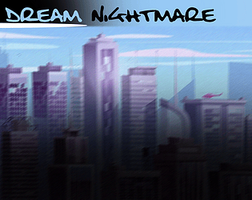

# Durant le SUMMER CAMP réalisé par O'CLOCK, j'ai pu réaliser plusieurs jeux vidéo 2D.

## DREAM NIGHTMARE

Retrouvez-vous en train de tomber d’un gratte-ciel, au plus profond d’une métropole futuriste.
Dans cette chute, des objets du quotidien tombent avec vous. Évitez-les, car au moindre contact avec l’un de ces objets, vous réapparaissez au début du niveau !

[LIEN VERS DREAM NIGHTMARE](https://a-rthuuur.itch.io/nightmare)

## LIFE OF HEARTH

Ce jeu est une reproduction de Doodle Jump.

[LIEN VERS LIFE OF HEARTH](https://a-rthuuur.itch.io/life-of-hearth)
